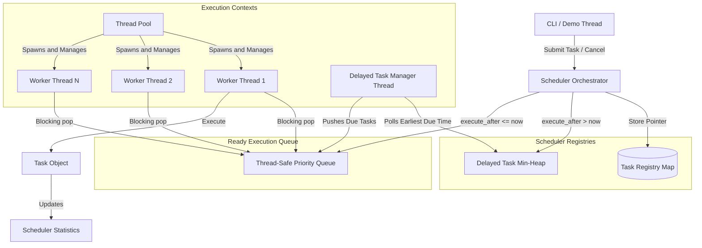

# SmartScheduler: Production-Style Multithreaded Task Scheduler in C++17

A highly robust, high-performance, and feature-rich **Multithreaded Task Scheduler** built in modern C++17. This project demonstrates systems programming, multithreading, synchronization primitives, thread pools, and producer-consumer architecture, implemented from the ground up without external dependencies.

To guarantee compilation on Windows systems across all compilers (including MinGW distributions built with the `win32` thread model that lack native support for `<thread>` and `<mutex>`), this project utilizes a custom **Win32 concurrency wrapper** that interfaces directly with Windows thread and synchronization APIs.

---

## 1. Project Overview & Motivation
In software engineering, a task scheduler is a fundamental component of concurrent systems, operating systems, database backends, and web servers. Building a task scheduler from scratch provides deep insights into:
* How thread pools manage execution context life cycles to avoid spawning thread overhead.
* How thread-safe data structures prevent data races and deadlocks.
* How condition variables eliminate busy-waiting, reducing CPU utilization to 0% when idle.
* How cooperative cancellation permits responsive UI interruptions while ensuring resource cleanup.

---

## 2. System Architecture



---

## 3. Features
1. **Thread Pool**: Configurable worker pool executing tasks concurrently without thread recreation overhead.
2. **Priority Scheduling**: Processes tasks based on priority (HIGH > MEDIUM > LOW).
3. **FIFO Ordering Fallback**: Ensures FIFO (First-In, First-Out) execution ordering for tasks with equal priority.
4. **Delayed Tasks**: Schedules tasks for future execution using a dedicated manager thread that sleeps until the earliest task is due.
5. **Cooperative Cancellation**: Gracefully cancels pending tasks instantly or stops running tasks at safe boundaries without resource leaks.
6. **Automatic Retries**: Retries failing tasks automatically up to a configurable maximum count with thread-safe tracking.
7. **Thread-Safe Logging**: Monotonically prints timestamped logs down to millisecond precision without console output interleaving.
8. **Real-time Statistics**: Aggregates real-time, atomic metrics (completed, failed, cancelled, active workers, average execution duration).

---

## 4. Concurrency & Synchronization Concepts Used
* **Custom Win32 Concurrency Primitive Wrappers**: Thin C++ wrappers around native Win32 `CRITICAL_SECTION`, `CONDITION_VARIABLE`, `CreateThread`, and `SleepConditionVariableCS` to solve compiler issues on Win32-threaded MinGW.
* **Thread Pool & Producer-Consumer**: Workers are *Consumers* waiting on the active queue's condition variable. Submission threads act as *Producers* pushing tasks and notifying workers.
* **FIFO Priority Min-Heap**: Uses `std::priority_queue` with a custom comparator sorting by `Priority` first, and falling back to a unique `sequence_number` to guarantee FIFO.
* **Atomic Variables**: Tracks metrics (`stats_`) and cancellation tokens using lock-free, atomic operations (`std::atomic`).
* **RAII Lock Wrappers**: Custom `LockGuard` and `UniqueLock` classes to lock and unlock mutexes automatically at scope entry/exit.

---

## 5. Implementation Details

### How the Thread Pool Works
On startup, `ThreadPool::start()` creates `N` threads. Each thread executes a `worker_loop` that blocks on `scheduler_.popTask()`. When a task is pushed, one worker is unblocked, executes the task, manages retries, updates statistics, and loops back to wait.

### How Task Prioritization Works
Tasks are ordered using a min-heap comparator:
```cpp
bool operator<(const QueuedTask& other) const {
    if (task->getPriority() != other.task->getPriority()) {
        return task->getPriority() < other.task->getPriority();
    }
    return sequence > other.sequence; // FIFO fallback
}
```

### How Graceful Shutdown Works
1. `Scheduler::shutdown()` sets a `scheduler_shutdown_` flag to stop accepting new tasks.
2. The delayed task worker thread is notified, exits its loop, and is joined.
3. `TaskQueue::shutdown()` sets `shutdown_ = true`, clears pending tasks, and wakes up all waiting worker threads via `notify_all()`.
4. Workers see `shutdown_ == true`, exit their loops, and terminate.
5. The thread pool joins all worker threads, ensuring no thread is left running.

---

## 6. How to Build & Run

### Prerequisites
* **CMake** 3.12 or newer.
* **C++17 Compiler** (GCC, Clang, or MSVC).

### Building the Project
From the repository root directory, run:
```cmd
mkdir build
cd build
cmake .. -G "MinGW Makefiles"
cmake --build .
```

### Running the CLI
Run the compiled main executable:
```cmd
.\SmartScheduler.exe
```

### Running the Unit Tests
Run the compiled test suite:
```cmd
.\SmartSchedulerTests.exe
```

---

## 7. Interactive CLI Commands
* `submit <name> <priority> <duration> [--delay <delay_sec>] [--retries <count>]`: Submits a task.
* `cancel <task_id>`: Cancels a pending task or requests cooperative cancellation of a running task.
* `status <task_id>`: Displays detailed metadata and timestamps for a task.
* `list`: Renders a table of all tasks submitted in the session.
* `stats`: Displays scheduler performance statistics.
* `demo`: Launches the concurrency and priority scheduling demonstration.
* `help`: Prints the command guide.
* `exit`: Gracefully shuts down the thread pool and exits the CLI.

---

## 8. Demonstration Scenario

When you type `demo` in the CLI, the following sequence occurs:
1. **Concurrency Check**: Spawns 4 long-running tasks. With 4 workers active, all 4 tasks start execution concurrently.
2. **Priority Check**: While the workers are busy, we submit five tasks: `LOW #1`, `HIGH #2`, `MEDIUM #3`, `HIGH #4`, and `LOW #5`. As workers become free, they execute the `HIGH` tasks first, then `MEDIUM`, and finally `LOW` (with FIFO preservation).
3. **Delayed Execution**: Submits a task with a 5-second delay. It is queued in a delayed min-heap, and the scheduler thread wakes up 5 seconds later to transfer it to the active queue.
4. **Retry Mechanism**: Submits a custom callback task that simulates failures twice and succeeds on the third attempt. The scheduler logs the attempts and recovers successfully.

---


## 9. Future Improvements
1. **Work Stealing**: Implement separate task queues per worker thread to reduce lock contention on a single shared queue.
2. **Task Dependencies**: Support scheduling tasks that wait for the completion of other tasks (Direct Acyclic Graph - DAG scheduling).
3. **Dynamic Pool Resize**: Allow the thread pool to scale workers up/down dynamically based on load.
