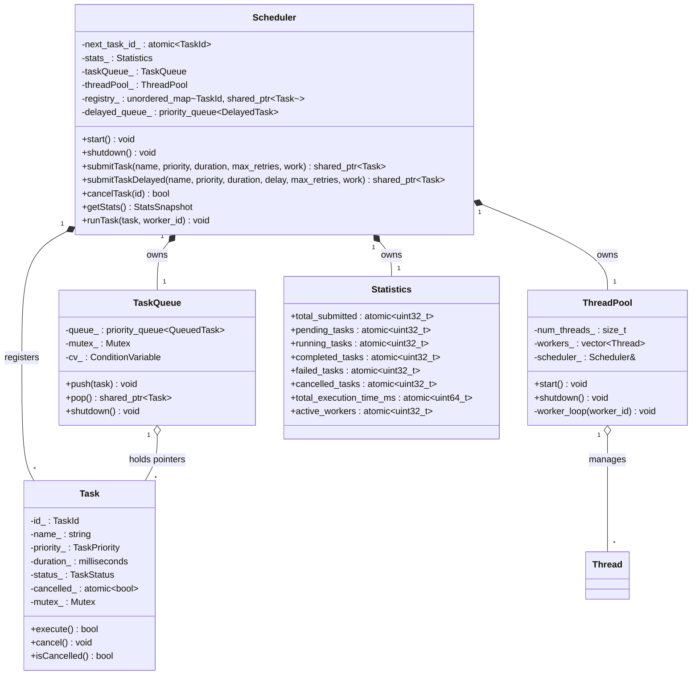
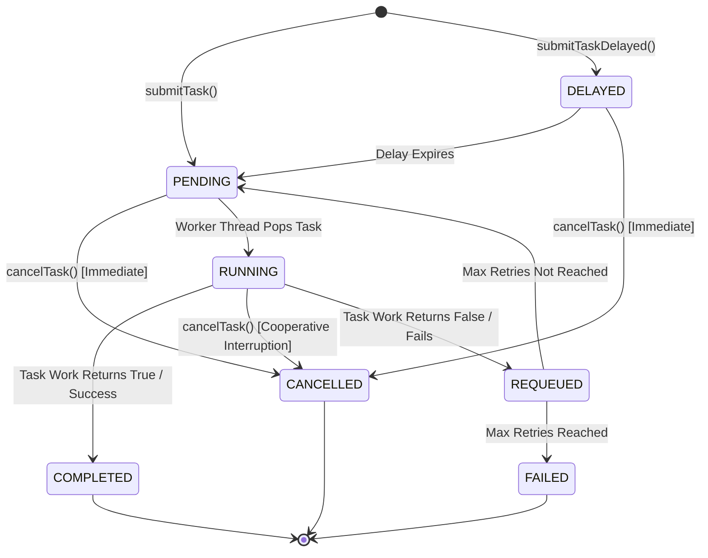
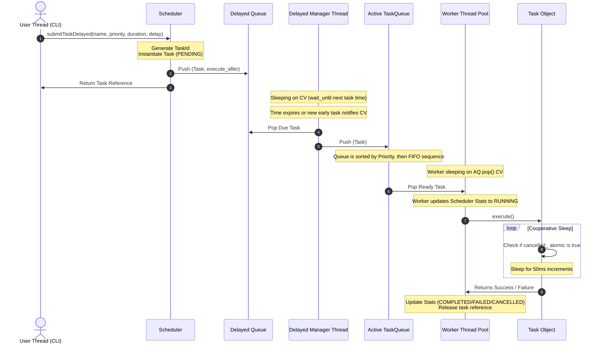

# System Architecture & Component Interaction Guide

This document provides a deep dive into the design patterns, sequence flows, data structures, and state transitions that form the core of the **SmartScheduler** engine.
<!-- full diagram with proper explanation of implentation -->
---

## 1. Class Structure and Domain Boundaries

The diagram below details the structural ownership and interface boundaries between components. The `Scheduler` acts as a facade, coordinating the storage (`registry`), immediate queueing (`TaskQueue`), future queueing (`delayed_queue`), and thread pools.

---

## 2. Task Lifecycle State Machine

Tasks transit through several states during their existence. The diagram below maps how external calls (`submit`, `cancel`) and internal outcomes (`success`, `failure`, `retry`) drive these state transitions.

---

## 3. Sequence Diagram: Task Lifecycle Flow

This diagram traces the exact temporal sequence and thread transitions when a user submits a task, when the delayed manager wakes up, and when a worker executes it.

---

## 4. Data Storage and Memory Management

1. **The Registry (`registry_`)**:
   * **Type**: `std::unordered_map<TaskId, std::shared_ptr<Task>>`
   * **Purpose**: Prevents garbage collection of task instances during execution, provides instantaneous lookup for CLI queries (`status`, `cancel`), and maintains memory tracking.
   * **Locking Strategy**: Protected by a dedicated, local `Mutex registry_mutex_`.
2. **Active Priority Queue (`queue_`)**:
   * **Type**: `std::priority_queue<QueuedTask>`
   * **Purpose**: Buffers tasks that are ready for immediate execution, sorted by Priority with FIFO fallback.
   * **Locking Strategy**: Protected internally by `TaskQueue`'s `Mutex`.
3. **Delayed Priority Queue (`delayed_queue_`)**:
   * **Type**: `std::priority_queue<DelayedTask>` (Min-heap sorted by execution time)
   * **Purpose**: Holds future tasks.
   * **Locking Strategy**: Guarded by `delayed_mutex_`. Uses `delayed_cv_` to sleep and wake up the delayed worker thread.
