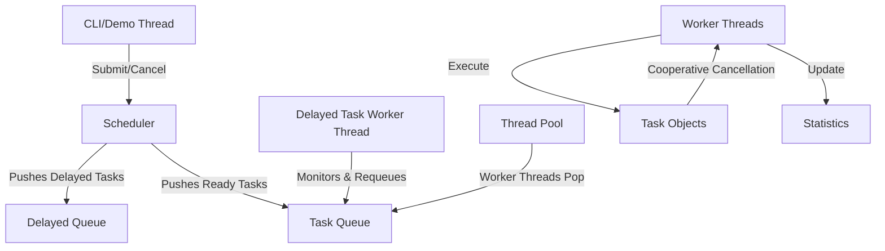

# Implementation Plan - C++ Multithreaded Task Scheduler
## Execution Phases
<!-- ek ek karke phase wise implement karna hai , ek phase complete hone ke baad hi next phase implement karna hai -->

<!-- 
compiler --host	mingw64
compiler	C:\msys64\mingw64\bin\g++.exe
compiler version	14.1.0
c++ standard	c++17
  -->

### Phase 1: Core Domain Abstraction
* Implement `Task.h` and `Task.cpp`.
* Define `TaskPriority` (LOW, MEDIUM, HIGH) and `TaskStatus` (PENDING, RUNNING, COMPLETED, FAILED, CANCELLED).
* Build cooperative cancellation checks and duration sleep loops.

### Phase 2: Work Buffer Queue
* Implement `TaskQueue.h` and `TaskQueue.cpp`.
* Build priority-based queue sorting using `std::priority_queue`.
* Implement monotonic `sequence_number` comparisons to guarantee FIFO ordering fallback for identical priorities.
* Implement thread-safe synchronization using `Mutex` and `ConditionVariable` monitor patterns.

### Phase 3: Worker Execution Contexts
* Implement `Concurrency.h` wrappers for native Win32 APIs.
* Implement `ThreadPool.h` and `ThreadPool.cpp` to start worker threads and coordinate blocking pop loops.
* Implement thread pool shutdown logic to join worker threads without leaks.

### Phase 4: System Orchestration & Metrics
* Implement `Statistics.h` with atomic tracker variables.
* Implement `Logger.h` for synchronized logging outputs.
* Implement `Scheduler.h` and `Scheduler.cpp` for task registries, status queries, and delayed queue min-heap checking threads.

### Phase 5: Verification & CLI Runner
* Implement `tests.cpp` to verify stable FIFO priority heaps, timings, retries, and cancellations.
* Implement `main.cpp` for interactive CLI command inputs and demo simulations.


Build a complete portfolio-quality, production-style Multithreaded Task Scheduler in modern C++17. The project will feature a thread-safe priority queue, thread pool, delayed task manager, cooperative cancellation, retry mechanisms, and a CLI/demo runner.

## User Review Required

> [!IMPORTANT]
> The compiler available on this system is **MinGW GCC 6.3.0**. GCC 6.3.0 has standard support for C++17, but standard filesystem libraries might have limited support depending on the exact build. The code is designed to use standard C++17 concurrency and time features (`std::thread`, `std::mutex`, `std::condition_variable`, `std::chrono`) which are fully supported.
> 
> A custom lightweight test runner will be built in the `tests/` directory instead of using external test frameworks (like Google Test). This avoids network dependencies, builds faster, and presents a self-contained systems project.


## Proposed Changes

The code structure is organized as follows:



### Build & Project Files

#### [NEW] [CMakeLists.txt](file:///c:/Users/kumar/OneDrive/Desktop/SmartScheduler/CMakeLists.txt)
Defines the CMake project, C++17 requirement, include directories, executable targets, and test runner targets.

#### [NEW] [.gitignore](file:///c:/Users/kumar/OneDrive/Desktop/SmartScheduler/.gitignore)
Standard Git ignore rules for CMake builds, MSVC builds, and editor directories.

---

### Core Components

#### [NEW] [Task.h](file:///c:/Users/kumar/OneDrive/Desktop/SmartScheduler/include/Task.h)
Header for the `Task` abstraction. Defines task statuses (`PENDING`, `RUNNING`, `COMPLETED`, `FAILED`, `CANCELLED`), task priorities (`LOW`, `MEDIUM`, `HIGH`), timestamps, retry tracking, execution logic (both custom callbacks and simulated workloads), and cooperative cancellation methods.

#### [NEW] [Task.cpp](file:///c:/Users/kumar/OneDrive/Desktop/SmartScheduler/src/Task.cpp)
Implementation of the task execution logic. Includes cooperative cancellation loops (sleeping in small steps to check the cancellation token) and retry/status management.

#### [NEW] [TaskQueue.h](file:///c:/Users/kumar/OneDrive/Desktop/SmartScheduler/include/TaskQueue.h)
Header for the thread-safe priority queue.
* Compares tasks by priority (HIGH > MEDIUM > LOW).
* For equal priorities, enforces FIFO using an auto-incrementing submission sequence number.

#### [NEW] [TaskQueue.cpp](file:///c:/Users/kumar/OneDrive/Desktop/SmartScheduler/src/TaskQueue.cpp)
Implementation of the thread-safe priority queue using `std::priority_queue`, `std::mutex`, and `std::condition_variable`.

#### [NEW] [ThreadPool.h](file:///c:/Users/kumar/OneDrive/Desktop/SmartScheduler/include/ThreadPool.h)
Header for the reusable `ThreadPool`. Configures worker threads that wait for work without busy-waiting.

#### [NEW] [ThreadPool.cpp](file:///c:/Users/kumar/OneDrive/Desktop/SmartScheduler/src/ThreadPool.cpp)
Implementation of the worker thread loops. Workers ask the scheduler/queue for tasks, track task start/completion times, handle execution errors, trigger retry logic if required, and manage active worker statistics.

#### [NEW] [Statistics.h](file:///c:/Users/kumar/OneDrive/Desktop/SmartScheduler/include/Statistics.h)
A header-only thread-safe tracker for overall scheduler metrics (submitted, pending, running, completed, failed, cancelled, total runtime, active workers) using atomic operations.

#### [NEW] [Logger.h](file:///c:/Users/kumar/OneDrive/Desktop/SmartScheduler/include/Logger.h)
A thread-safe static logger class that prints timestamps down to millisecond precision without interleaving output.

#### [NEW] [Scheduler.h](file:///c:/Users/kumar/OneDrive/Desktop/SmartScheduler/include/Scheduler.h)
Header for the central orchestrator coordinating the thread pool, task queue, delayed tasks, task registry, and stats.

#### [NEW] [Scheduler.cpp](file:///c:/Users/kumar/OneDrive/Desktop/SmartScheduler/src/Scheduler.cpp)
Implementation of the Scheduler:
* `submitTask`: creates a new task and pushes it to the active task queue.
* `submitTaskDelayed`: handles tasks scheduled for the future by placing them in a delayed queue.
* `delayedTaskWorkerLoop`: a dedicated thread waiting on a condition variable with a timeout corresponding to the next due task. Pushes due tasks into the active queue.
* `cancelTask`: handles cancellation (pending cancellation is immediate, running tasks are cooperatively cancelled).
* Graceful shutdown sequence ensuring all workers finish current tasks and exit.

---

### Application Entrypoints

#### [NEW] [main.cpp](file:///c:/Users/kumar/OneDrive/Desktop/SmartScheduler/src/main.cpp)
Interactive CLI application:
* Command parser for `submit`, `cancel`, `status`, `list`, `stats`, `help`, `shutdown`, and `exit`.
* Automatic demo mode demonstrating concurrent task execution, priority queue scheduling (HIGH priority over LOW), and graceful shutdown.

#### [NEW] [tests.cpp](file:///c:/Users/kumar/OneDrive/Desktop/SmartScheduler/tests/tests.cpp)
Comprehensive test suite asserting:
* Task priority ordering (HIGH > MEDIUM > LOW, FIFO on equal priority).
* Thread safety of parallel submissions.
* Cooperative task cancellation.
* Task retry functionality (failing up to N times before success or final failure).
* Delayed task execution timing.
* Statistics correctness.
* Graceful shutdown.

## Verification Plan

### Automated Tests
Build and run the test runner executable:
```cmd
mkdir build
cd build
cmake ..
cmake --build . --config Release
.\tests.exe
```

### Manual Verification
Run the main CLI executable to trigger the demo scenario:
```cmd
.\SmartScheduler.exe
```
Validate operations using the following CLI commands:
* `submit "Test Task" HIGH 3`
* `submit "Delayed Task" LOW 2 --delay 5`
* `list`
* `stats`
* `cancel 1` (test cancellation)
* `exit`
